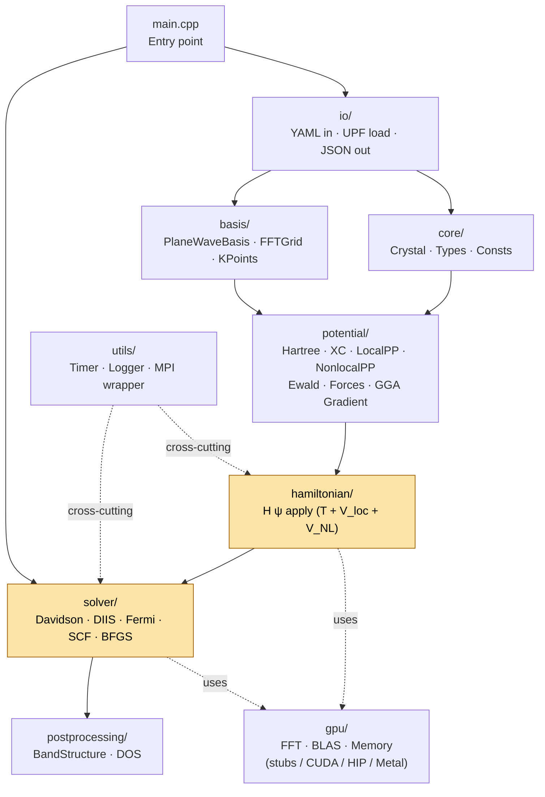

# Component Diagram

KRONOS is organized as a layered set of modules under `src/`, each with strict dependency rules that prevent circular imports and keep the GPU abstraction boundary clean. The diagram below shows how data and control flow from the entry point down through the physics layers. See [Source Layout](source-layout.md) for the full file-by-file breakdown, and [GPU Portability](gpu-portability.md) for how the `gpu/` abstraction layer is structured.

Module dependencies flow top-to-bottom. Each box is a directory under `src/`.

Dependency rules:
- `core/` depends on nothing (leaf module).
- `basis/` depends on `core/`.
- `io/` depends on `core/` (Crystal, types).
- `potential/` depends on `core/`, `basis/`, `io/` (for `PseudoPotential` data).
- `hamiltonian/` depends on `basis/`, `potential/` (specifically `NonlocalPP`).
- `solver/` depends on everything above; it orchestrates the full calculation.
- `gpu/` is called by `hamiltonian/` and `basis/` but physics code never
  calls vendor APIs directly -- only the `gpu::` namespace.
- `utils/` is available to all modules (timer, logger).
