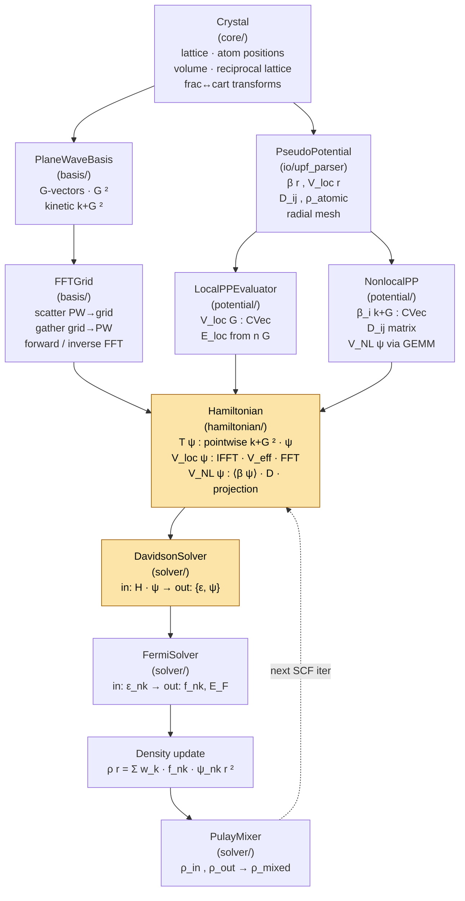

# Data Flow Through the SCF Loop

During each SCF iteration, a fixed set of data objects is constructed, transformed, and passed between modules. Understanding this flow is essential for tracing a bug or adding a new contribution to the total energy. The two-grid distinction — PW basis for wavefunctions versus the full FFT grid for density and potentials — is the most common source of confusion and is explained in detail below. See the [SCF Flowchart](scf-flowchart.md) for the high-level loop structure, and [Key Algorithms](algorithms.md) for the mathematical content of each step.

The key data objects and how they flow between modules during each SCF step:

### Summary of Key Data Objects

| Object | Type | Lives in | Flows to |
|--------|------|----------|----------|
| `psi_nk(G)` | `CVec` (complex128) | Davidson output | density construction, forces |
| `rho(r)` | `RVec` (float64) | real-space grid | XC evaluator, density mixing |
| `rho(G)` | `CVec` | full FFT grid | Hartree solver, local PP energy |
| `V_eff(r)` | `vector<complex_t>` | real-space grid | `Hamiltonian::update_veff` |
| `V_H(G)` | `vector<complex_t>` | full FFT grid | added to V_eff in G-space |
| `V_loc(G)` | `vector<complex_t>` | full FFT grid | added to V_eff in G-space (pre-computed once) |
| `V_xc(r)` | `RVec` | real-space grid | added to V_eff in real space |
| `epsilon_nk` | `double` | per band per k | Fermi solver, band energy |
| `f_nk` | `double` | per band per k | density construction, energy |

### Two Grids: PW Basis vs Full FFT Grid

A critical implementation detail is the distinction between two reciprocal-space
representations:

1. **PW basis** (`PlaneWaveBasis::gvectors()`): G-vectors where `|G|^2 <= ecutwfc`.
   Used for wavefunctions and the eigensolver.

2. **Full FFT grid** (`FFTGrid`, dimensioned for `ecutrho >= 4*ecutwfc`): All grid
   points up to the density cutoff. Used for the Hartree potential, V_loc, and
   density to avoid aliasing from `|psi|^2` products.

The `scatter_to_grid` and `gather_from_grid` methods on `FFTGrid` convert between
these two representations by mapping PW Miller indices `(h,k,l)` to FFT grid
linear indices.
