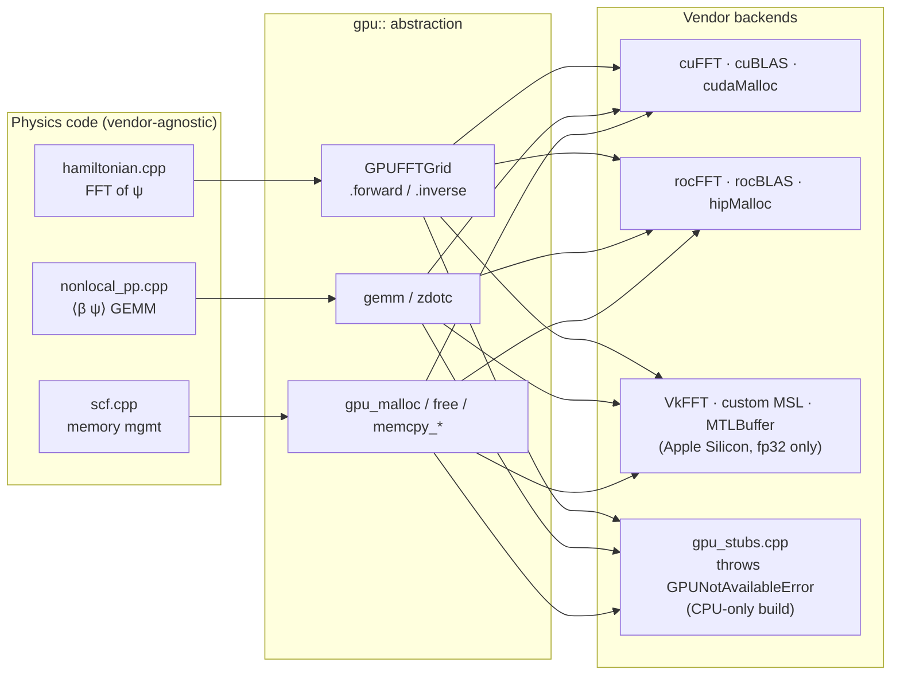

# GPU Portability

The `kronos::gpu` namespace is the single point of coupling between physics code and vendor GPU APIs. Every call to cuFFT, rocFFT, cuBLAS, rocBLAS, or Metal goes through one of three thin wrappers — `GPUFFTGrid`, `gemm/zdotc`, and `gpu_malloc/free/memcpy_*` — so that adding a new hardware backend requires touching only `src/gpu/`, not any physics source files. This page describes the abstraction contract, the CPU stub path, and the Apple Silicon Metal backend including its fp32-only constraint. See [Component Diagram](component-diagram.md) for where `gpu/` sits in the dependency graph.

The `kronos::gpu` namespace provides a hardware abstraction layer so that
physics code in `src/hamiltonian/`, `src/basis/`, and `src/solver/` never
calls vendor APIs (CUDA, HIP) directly.

In CPU-only builds (`KRONOS_GPU_BACKEND=none`), `src/gpu/gpu_stubs.cpp`
provides stub implementations that throw `GPUNotAvailableError`. Physics code
uses FFTW3 and CPU BLAS/LAPACK directly, bypassing the GPU layer entirely.

For deterministic GPU results, set `CUBLAS_WORKSPACE_CONFIG=:4096:8`.

### Metal backend (Apple Silicon, v0.5.1)

The Metal backend mirrors the CUDA/HIP pattern, but is fundamentally a
**research/dev tier only**:

- `src/gpu/gpu_context_metal.cpp` — MTLDevice + MTLCommandQueue
- `src/gpu/memory_metal.cpp` — MTLBuffer with `storageModeShared` (Apple
  Silicon's unified memory is exposed as gpu_malloc-compatible pointers
  via a host→MTLBuffer registry)
- `src/gpu/blas_metal.cpp` — complex GEMM dispatched to
  `src/gpu/kernels/complex_gemm.metal`, an MSL `zgemm_fp32` kernel.
  Narrows complex128 → complex64 at the device boundary when
  `apple_fast_mode == true`; otherwise throws so GPUHamiltonian falls
  back to CPU.
- `src/gpu/fft_metal.cpp` — VkFFT (v1.3.4) Metal backend for 3D complex
  FFT in fp32. Same narrow/widen boundary as BLAS.

#### Why fp32 only?

Apple's Metal Shading Language refuses `double` outright across all Metal
versions and toolchain releases — Apple GPUs have no hardware fp64 ALUs.
There is no emulation path. CUDA and HIP retain real fp64 hardware support
and remain the only validation-grade GPU backends.

#### When the Apple GPU path runs

- `hardware.apple_fast_mode: true` in YAML, OR
- `--apple-fast-mode` CLI flag

Both produce a logger warning (`apple_fast_mode` event) at startup. The
validation test suite (`test_validation`) refuses to run when this flag
is on.

See `docs/superpowers/specs/2026-05-16-apple-silicon-metal-backend-design.md`
for the full design rationale.
