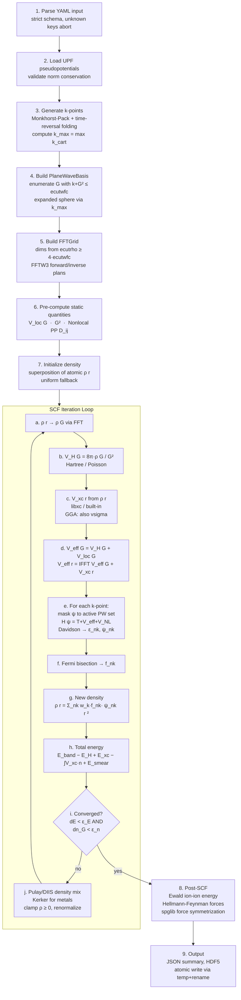

# SCF Workflow Flowchart

The self-consistent field loop is the central algorithm in KRONOS. The outer flow is linear — parse input, build the plane-wave basis, initialize the electron density, iterate until convergence, then post-process — while the inner SCF loop iterates between the Hamiltonian application, eigensolver, Fermi level solver, and density mixer until energy and density residuals fall below the convergence thresholds. See [Key Algorithms](algorithms.md) for pseudocode details on each sub-step, and [Data Flow](data-flow.md) for how the key data objects move between modules.

The self-consistent field loop is the central algorithm. The outer flow is
linear (parse, build, iterate, post-process), while the SCF loop iterates
until convergence.

